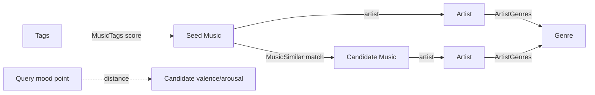

# Canvas GraphRAG Hybrid Search 설계

## 1. 목적

`/api/v1/canvas/graphrag`의 현재 `music_tags` 직접 연결 검색을 다음 그래프 신호까지 확장한다.

1. `music_similar`: 태그로 찾은 곡에서 유사 곡으로 이동하는 2-hop 확장
2. `artist_genres`: 아티스트 장르 기반 연관성과 클러스터 보강
3. `valence/arousal`: 검색 무드와 곡 무드 좌표의 거리 기반 연관성

기존 응답 계약과 빈 상태 처리를 유지하면서 후보 폭, 설명 가능성, 데이터가 일부 없는 상황의 안정성을 높이는 것이 목표다.

## 2. 기준 구현과 전제

현재 `develop`에는 GraphRAG 입력 데이터 구조와 수집 기반이 병합돼 있다.

- 데이터 모델: `MusicTags`, `MusicSimilar`, `ArtistGenres`, `Music.valence`, `Music.arousal`
- 수집 기반: Last.fm 무드 태그/유사곡 enrichment, `seed_graphrag`, `graph_readiness`
- 구현 대상 서비스: `music/services/internal/canvas_graphrag_service.py`
- 구현 대상 View: `music/views/canvas.py`
- 구현 대상 DTO: `music/serializers/canvas.py`
- 구현 대상 테스트: `music/tests/test_canvas.py`

이 프로젝트의 그래프는 Neo4j가 아니라 PostgreSQL 관계 테이블을 Django ORM으로 순회하는 관계형 그래프다. 현재 LLM 컨텍스트 생성 단계는 없으므로 여기서 GraphRAG는 그래프 관계를 이용한 검색과 랭킹을 뜻한다.

## 3. 현재 구조

### 3.1 목표 1차 요청 흐름

```text
GET /api/v1/canvas/graphrag?tags=happy,upbeat&limit=120
  -> CanvasGraphRagView
  -> CanvasGraphRagService.search()
     -> 입력 태그 정규화: 최대 3개
     -> Music / Tags / MusicTags readiness 확인
     -> Tags.tag_key exact match
     -> MusicTags 직접 엣지 조회
     -> 곡별 직접 점수 MAX
     -> 후보 집합 내 min-max 정규화
     -> relevance_score, visual_weight, explanation 생성
  -> CanvasGraphRagResponseSerializer로 응답 재검증
```

### 3.2 목표 1차 그래프


- 후보는 검색 태그와 직접 연결된 곡만 포함한다.
- 여러 검색 태그와 연결돼도 `direct_tag_score`는 가장 큰 엣지 하나만 사용한다.
- `relevance_score`는 후보 집합의 최소/최대값에 의존한다.
- 후보가 하나거나 모든 점수가 같으면 일괄 `0.5`가 된다.
- `visual_weight = sqrt(relevance_score)`다.
- 설명 DTO는 이미 `{type, path, weight, reason}` 형태라 경로 확장에 적합하다.
- `graph_version`은 `direct-tag-v1`이다.

### 3.3 현재 존재하는 DB 구조



| 신호 | 저장 위치 | 적재 상태 | Canvas 사용 상태 |
|---|---|---|---|
| 태그-곡 | `music_tags(music_id, tag_id, score)` | Last.fm enrichment가 적재 | 직접 후보/점수 사용 |
| 곡-곡 유사 | `music_similar(music_id, similar_music_id, match)` | Last.fm enrichment가 적재 | 미사용 |
| 아티스트-장르 | `artist_genres(artist_id, genre_id)` | 모델만 존재, production writer 없음 | 미사용 |
| 무드 좌표 | `music.valence`, `music.arousal` | 무드 태그 가중 평균으로 적재 | 미사용 |

### 3.4 데이터와 코드 제약

1. `music_similar`는 Last.fm 응답의 source -> target 단방향 레코드다.
2. 유사곡 대상이 수집 시점에 DB에 이미 있고 아티스트명/곡명이 정확히 일치할 때만 엣지가 생기므로 희소할 수 있다.
3. `artist_genres`는 조회 모델만 있고 현재 Deezer 저장 흐름에는 장르 적재가 없다.
4. `Genres.genre_name`은 nullable이며 unique 제약이 없어 canonicalization 전에는 중복 가능성이 있다.
5. track mood tag가 없으면 artist mood tag를 곡 태그로 저장하므로 source provenance가 사라진다.
6. `MusicTags.score`는 nullable이고 `MusicSimilar.match`에는 DB 범위 제약이 없다.
7. readiness는 `Music`, `Tags`, `MusicTags` 존재 여부만 검사한다.
8. 현재 테스트는 empty data와 direct happy edge 응답 shape만 잠근다.

## 4. 목표 검색 흐름

```text
query tags
  -> resolve Tags
  -> derive query mood centroid / query genre intent
  -> direct MusicTags seeds
  -> expand seeds through MusicSimilar
  -> collect candidate artist genres and mood coordinates
  -> accumulate per-candidate evidence
  -> absolute normalized component scores
  -> weighted fusion
  -> deterministic ranking
  -> existing response + optional breakdown/explanations
```

후보 생성과 feature scoring을 분리한다.

```python
CandidateEvidence(
    music=music,
    direct_tag_score=0.86,
    similar_score=0.62,
    genre_score=0.50,
    mood_score=0.91,
    matched_tags=[...],
    paths=[...],
)
```

`CanvasGraphRagService.search()`는 orchestration만 담당하고 다음 private 단계로 나눈다.

```text
_resolve_query()
_build_direct_candidates()
_expand_similar_candidates()
_attach_genre_scores()
_attach_mood_scores()
_rank_and_serialize()
```

별도 repository 계층은 현재 프로젝트 패턴에 없으므로 첫 구현에는 추가하지 않는다. ORM 쿼리가 커지면 서비스 내부 query helper부터 분리한다.

## 5. 신호별 설계

### 5.1 직접 태그 점수

직접 경로:

```text
query tag -> Tags -> MusicTags -> Music
```

여러 검색 태그를 하나의 `MAX`로 축소하지 않고 검색 태그 coverage와 edge score를 함께 반영한다.

```text
direct_tag_score
  = sum(score of matched query tags) / number of resolved query tags
```

규칙:

- 각 edge score는 `[0, 1]`로 clamp한다.
- 검색된 태그가 3개이고 곡이 그중 하나에만 연결되면 나머지는 0으로 포함한다.
- 이 방식은 하나의 강한 태그만 맞는 곡보다 여러 의도를 고르게 충족하는 곡을 우대한다.
- `matched_tags`는 기존처럼 실제 연결된 태그와 원시 score를 모두 보존한다.
- direct candidate가 이후 확장의 seed가 된다.

### 5.2 `music_similar` 2-hop 확장

여기서 2-hop은 그래프의 전체 검색 경로를 의미한다.

```text
query tag -> seed music -> similar music
```

`music_similar` 내부만 두 번 연속 순회하는 `seed -> intermediate -> candidate`는 이번 버전의 3-hop 확장 범위에서 제외한다. 데이터 밀도와 latency를 확인한 뒤 다음 버전에서 검토한다.

#### 방향 정책

저장은 방향성을 유지하되 검색은 outgoing과 incoming을 모두 인접 관계로 읽는다.

```text
music_id IN seed_ids OR similar_music_id IN seed_ids
```

동일 곡 쌍의 양방향 레코드가 존재하면 `max(forward_match, reverse_match)`를 사용한다. DB에 대칭 엣지를 복제하지 않는다.

#### 경로 점수

```text
path_score = seed.direct_tag_score * edge.match * similar_decay
similar_decay = 0.75
similar_score(candidate) = max(all path_score to candidate)
```

`max`를 쓰는 이유는 여러 seed와 연결된 허브 곡이 단순 경로 수로 폭주하는 것을 막기 위해서다.

규칙:

- self-loop와 검색 seed 자신을 확장 후보에서 제외한다.
- 각 seed에서 `match` 상위 30개까지만 사용한다.
- 모든 seed 합계 확장 후보는 300개로 제한한다.
- direct와 similar 경로가 모두 있는 후보는 한 번만 반환하되 evidence는 모두 유지한다.
- `match`가 null 또는 범위 밖이면 clamp 후 사용하고 데이터 오류 지표에 포함한다.

설명 예시:

```json
{
  "type": "similar_track",
  "path": ["tag:happy", "music:12", "music:87"],
  "weight": 0.62,
  "reason": "검색 태그와 연결된 곡의 유사곡입니다."
}
```

### 5.3 `artist_genres`

`artist_genres`는 두 방식으로 사용한다.

#### A. 후보의 장르 일관성 보강

direct seed 아티스트 장르 집합과 candidate 아티스트 장르 집합의 weighted overlap을 계산한다.

```text
query_genre_weight(g)
  = max(direct_tag_score of seed tracks whose artist has g)

genre_score(candidate)
  = sum(query_genre_weight(g) for g in candidate genres)
    / sum(all query_genre_weight)
```

- direct seed가 형성한 장르 문맥에 가까운 similar candidate를 우대한다.
- seed가 많아도 인기 장르의 단순 빈도에 지배되지 않도록 장르별 `max`를 쓴다.

#### B. genre query의 직접 확장

검색 태그 중 `Tags.tag_type='genre'`인 항목만 normalized `Genres.genre_name`과 연결한다.

```text
query genre tag -> Genre <- ArtistGenres <- Artist <- Music
```

현재 Last.fm 파서는 무드 whitelist만 저장하므로 이 경로는 genre tag 적재가 시작된 뒤 활성화한다. 문자열이 우연히 같은 mood tag를 genre로 해석하지 않는다.

#### 적재 선행 조건

- 아티스트 장르 공급원을 먼저 확정한다. 권장은 Deezer artist 상세 계약 확인 후 별도 artist enrichment에서 저장하는 것이다.
- 공급원이 장르를 안정적으로 주지 않으면 Last.fm artist tag용 **별도 genre whitelist**를 둔다. mood whitelist와 섞지 않는다.
- 장르명은 `strip`, lowercase, 연속 공백 축약을 거친 canonical key로 저장한다.
- 기존 중복을 정리한 후 `Genres.genre_name`에 unique 제약을 추가한다.
- 공급자가 완전한 목록을 보장할 때만 이전 링크 중 누락된 것을 soft-delete한다.

장르 데이터가 준비되지 않았으면 `genre_score=missing`으로 두고 검색 전체를 실패시키지 않는다.

### 5.4 `valence/arousal`

검색 태그의 무드 좌표는 `MOOD_COORDS`를 이용해 query centroid로 만든다.

```text
query_v = average(valence of resolved mood tags)
query_a = average(arousal of resolved mood tags)
```

검색 태그 자체에는 가중치가 없으므로 단순 평균한다. 좌표가 있는 검색 태그가 하나도 없으면 mood component는 비활성화한다.

candidate와의 유사도:

```text
distance = sqrt((candidate_v - query_v)^2 + (candidate_a - query_a)^2)
mood_score = max(0, 1 - distance / mood_radius)
mood_radius = 1.0
```

- `valence/arousal`의 유효 범위는 각각 `[-1, 1]`이다.
- candidate 좌표가 null이면 `missing`이다.
- 범위 밖 값은 추천 계산에서 제외하고 readiness 이상치로 집계한다.
- 초기 후보는 direct 또는 similar 경로에서 얻은 곡으로 한정한다. 무드 좌표만으로 전체 Music 테이블을 스캔해 새 후보를 만들지 않는다.
- 향후 canvas 밀도를 더 높여야 할 때 bounding box를 이용한 mood-only 후보 확장을 별도 버전으로 추가한다.

설명 예시:

```json
{
  "type": "mood_proximity",
  "path": ["mood:0.65,0.45", "music:87"],
  "weight": 0.91,
  "reason": "검색 무드 좌표와 가까운 곡입니다."
}
```

## 6. 점수 결합

모든 component는 원래부터 `[0, 1]`인 절대 점수로 유지한다. 후보 집합에 따라 값이 바뀌는 현재 min-max 정규화는 제거한다.

초기 가중치:

| Component | Weight | 역할 |
|---|---:|---|
| `direct_tag_score` | 0.50 | 현재 검색 의미의 기준선 |
| `similar_score` | 0.25 | 그래프 2-hop 확장 |
| `genre_score` | 0.10 | 장르 문맥 보강 |
| `mood_score` | 0.15 | 연속형 무드 근접도 |

```text
relevance_score = 0.50 * direct_tag_score
                + 0.25 * similar_score
                + 0.10 * genre_score
                + 0.15 * mood_score
```

### 6.1 missing 신호 처리

가중치를 재정규화하지 않는다.

- missing component는 0 기여다.
- 태그 하나만 있는 후보가 남은 가중치를 독점하는 것을 방지한다.
- `music_similar`, `artist_genres`, 좌표가 비어 있어도 direct-tag 기준선은 그대로 동작한다.
- direct 연결이 없는 similar 후보의 최대 점수는 `0.25 * 0.75 = 0.1875` 이하이므로 강한 direct 후보를 쉽게 역전하지 않는다.

### 6.2 시각 가중치와 정렬

```text
visual_weight = sqrt(relevance_score)
```

기존 캔버스 면적 감각을 유지한다. 정렬은 결정적으로 만든다.

1. `relevance_score DESC`
2. 활성 evidence 종류 수 `DESC`
3. `direct_tag_score DESC`
4. `music_id DESC`

## 7. 응답 계약

기존 필드는 유지한다. 신규 필드는 optional로 추가해 기존 클라이언트를 깨뜨리지 않는다.

```json
{
  "music_id": 87,
  "relevance_score": 0.714,
  "visual_weight": 0.845,
  "cluster": "happy",
  "matched_tags": [],
  "score_breakdown": {
    "direct_tag": 0.86,
    "similar": 0.62,
    "genre": 0.50,
    "mood": 0.91
  },
  "source_types": ["direct_tag", "similar_track", "artist_genre", "mood_proximity"],
  "explanations": []
}
```

DTO 변경:

- `CanvasGraphRagScoreBreakdownSerializer` 추가
- item에 optional `score_breakdown`, `source_types` 추가
- 기존 generic explanation DTO는 그대로 사용
- `meta.graph_version = "hybrid-graph-v2"`
- meta에 optional coverage를 추가할 수 있다.

```json
{
  "signal_coverage": {
    "direct_tag": 42,
    "similar": 18,
    "artist_genre": 0,
    "mood": 37
  }
}
```

`cluster`는 direct matched tag가 있으면 최고 점수 태그를 유지한다. similar-only 후보는 해당 후보를 발견한 최고 path의 seed cluster를 상속한다.

## 8. 쿼리 및 성능

- 후보별 ORM 호출을 금지하고 단계별 batch query를 사용한다.
- direct edge는 현재처럼 `select_related` 한 번으로 읽는다.
- similar edge는 seed ID 전체에 대해 outgoing/incoming 각각 한 번씩 조회한다.
- 후보 artist genre는 candidate artist ID 전체에 대해 한 번에 조회한다.
- candidate Music은 `select_related('artist', 'album')`로 한 번에 조회한다.
- soft-delete manager가 기준 모델만 거르므로 조인 대상 music, artist, tag, genre에도 `is_deleted=False`를 명시한다.
- 목표 쿼리 수는 후보 수와 무관하게 10개 이하이다.

권장 인덱스:

```text
music_tags(tag_id, is_deleted, score)
music_similar(music_id, is_deleted, match)
music_similar(similar_music_id, is_deleted, match)
artist_genres(artist_id, is_deleted)
artist_genres(genre_id, is_deleted)
```

최대 결과 150개에 대해 내부 상한:

- direct seeds: 최대 150개
- seed별 similar edge: 최대 30개
- distinct similar candidates: 최대 300개
- fusion 전 전체 후보: 최대 450개

## 9. readiness와 degraded mode

전체 검색은 `music_tags`가 준비되면 동작한다. 추가 신호는 독립 readiness를 가진다.

| 상태 | 동작 |
|---|---|
| Music/Tags/MusicTags 없음 | 기존 `empty_data` 응답 |
| `music_similar` 없음 | direct + 가능한 genre/mood로 계속 |
| `artist_genres` 없음 | genre component만 비활성화 |
| query mood 좌표 없음 | mood component만 비활성화 |
| candidate mood 좌표 일부 없음 | 해당 후보 mood 기여만 0 |

`graph_readiness` 확장 지표:

```text
music_count
music_tag_edge_count
music_similar_edge_count
artist_genre_edge_count
tracks_with_tags_ratio
tracks_with_similar_ratio
artists_with_genres_ratio
tracks_with_mood_coords_ratio
invalid_mood_coords_count
ready_direct_tag
ready_similar
ready_artist_genre
ready_mood
```

meta에는 요청 당시 사용 가능한 signal을 선택적으로 노출한다.

```json
"available_signals": ["direct_tag", "similar", "mood"]
```

## 10. 데이터 적재 보완

### 10.1 Similar

- 신규 곡 저장 시 대상이 아직 없어 엣지를 잃는 문제를 줄이기 위해 신규 저장 후 해당 곡뿐 아니라 인접 기존 곡의 enrichment 재실행을 검토한다.
- `match`를 저장할 때 `[0, 1]` 검증을 추가한다.
- 이름 매칭은 정규화하고, 안정적인 외부 ID가 확보되면 우선 사용한다.
- self-loop는 저장하지 않는다.

### 10.2 Artist genre

- 공급원 계약 확정 전 추천 코드만 먼저 활성화하지 않는다.
- artist enrichment task, canonical genre upsert, `ArtistGenres` link sync를 한 단위로 구현한다.
- 장르 writer 테스트와 coverage 지표가 준비된 후 feature flag 없이 활성화한다.

### 10.3 Mood

- 태그 재수집 시 더 이상 반환되지 않은 기존 `MusicTags`를 정리해 태그 그래프와 좌표 계산의 기준을 맞춘다.
- track tag와 artist fallback의 provenance를 장기적으로 보존해야 한다. 이번 버전은 스키마를 늘리지 않고 현 상태를 사용한다.
- `valence`, `arousal` 각각 `[-1, 1]` check constraint를 추가한다.

## 11. 구현 단계

### Phase 0: 기준선 회귀 테스트

- 다중 query tag coverage
- direct 점수 순위
- 동일 점수 및 단일 후보
- resolved/unresolved 혼합
- soft-delete된 tag/music/edge 제외
- limit 정규화
- explanation과 graph version

### Phase 1: 점수 구조 개편

- candidate evidence 구조 도입
- direct tag coverage 점수 적용
- min-max 제거
- optional `score_breakdown`, `source_types`
- deterministic sort

### Phase 2: Similar 2-hop

- incoming/outgoing batch 조회
- path score, decay, max aggregation
- 후보/경로 상한
- `similar_track` explanation
- 인덱스 마이그레이션

### Phase 3: Mood

- query mood centroid
- candidate 거리 점수
- `mood_proximity` explanation
- 좌표 constraint와 readiness 지표

### Phase 4: Artist genre

- 장르 공급원과 canonicalization 확정
- production enrichment writer
- genre context score와 genre query path
- `artist_genre` explanation
- unique/index 마이그레이션

### Phase 5: 관측과 튜닝

- signal별 후보 수, 최종 채택 수, coverage, latency 로깅
- 고정 query tag 세트로 Precision@K 또는 수동 relevance 평가
- 가중치와 decay는 서비스 상수/단일 설정 객체에서 조정

## 12. 테스트 설계

### 단위 테스트

- direct tag: 한 개/여러 개/부분 coverage/빈 score
- similar: outgoing, incoming, 양방향 max, self-loop 제외
- similar path: direct score x match x decay, 여러 seed 중 max
- genre: seed context overlap, genre query, missing graph
- mood: centroid, 동일 좌표, radius 경계, null, 범위 밖
- fusion: missing 신호 비재정규화, 점수 상한, tie-break

### 통합 테스트

- direct edge만 있을 때 v1과 동일하게 결과가 반환됨
- direct seed의 similar 곡이 `tag -> seed -> candidate` 경로로 추가됨
- direct와 similar로 중복 발견된 곡이 한 번만 반환됨
- artist genre 데이터가 없어도 검색 성공
- mood 좌표 일부가 null이어도 검색 성공
- soft-delete된 모든 노드와 엣지가 제외됨
- serializer가 기존 필드와 신규 optional 필드를 함께 검증함
- 후보 수 증가에도 쿼리 수가 선형 증가하지 않음

### 적재 테스트

- 유사곡 대상이 DB에 있을 때만 엣지 생성
- match 범위와 self-loop 처리
- genre canonicalization과 중복 방지
- 태그 refresh 시 stale edge 정리
- valence/arousal 범위와 artist fallback

## 13. 완료 기준

1. 기존 endpoint, query parameter, empty/no-match 상태 계약이 유지된다.
2. `tag -> music -> similar music` 2-hop 후보가 검색 결과에 포함된다.
3. incoming/outgoing similar edge를 모두 사용하고 중복 후보를 합친다.
4. artist genre와 mood는 데이터가 있을 때 점수/설명을 보강하고, 없을 때 direct 검색을 방해하지 않는다.
5. 모든 component와 최종 relevance가 `[0, 1]`이다.
6. 후보 집합 변화에 따라 동일 곡의 절대 점수가 임의로 바뀌지 않는다.
7. 응답은 경로별 explanation과 optional breakdown을 제공한다.
8. 쿼리 수는 후보 개수에 비례해 증가하지 않는다.
9. 단위/통합/적재 테스트와 signal별 readiness가 추가된다.

## 14. 구현 전 결정 사항

1. 아티스트 장르 공급원: Deezer artist 상세 또는 Last.fm 별도 genre whitelist
2. genre query를 `Tags.tag_type='genre'`로 운영할 시점
3. similar seed별 fan-out 30, 전체 300 상한의 실제 데이터 적합성
4. mood radius 1.0과 초기 가중치의 평가 결과
5. track mood와 artist fallback provenance를 이번 스키마 변경에 포함할지 여부
